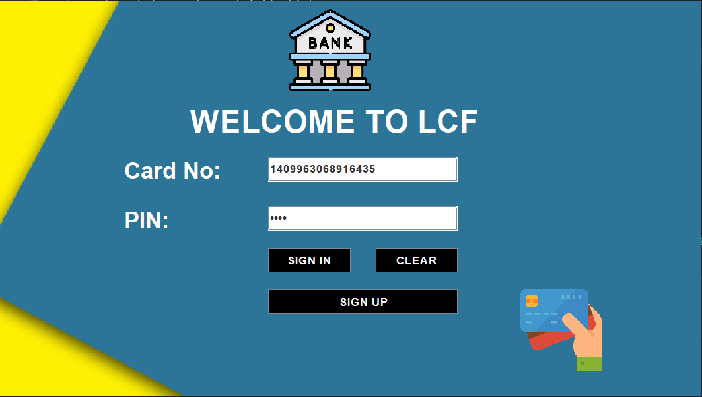
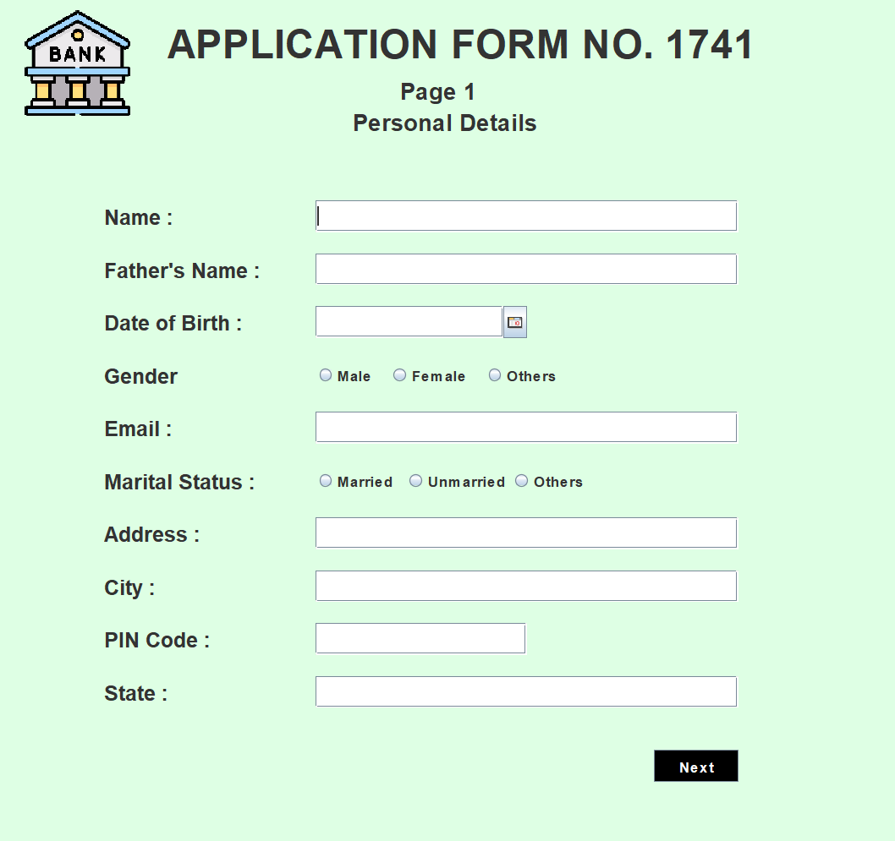
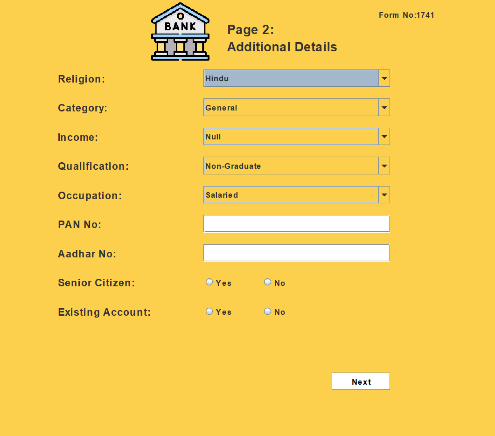
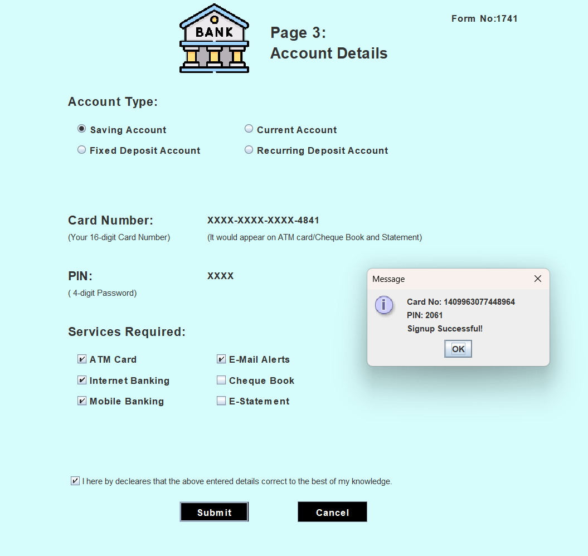
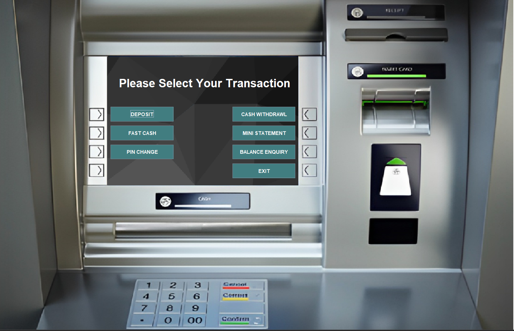
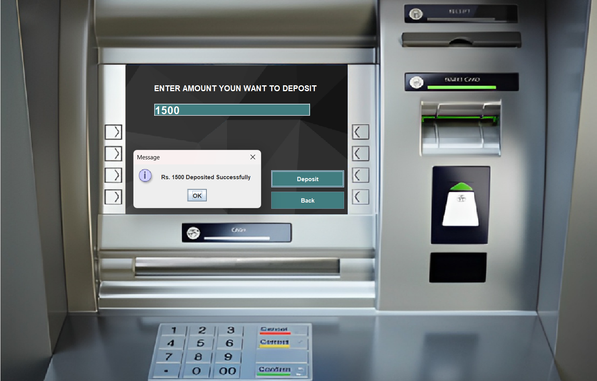
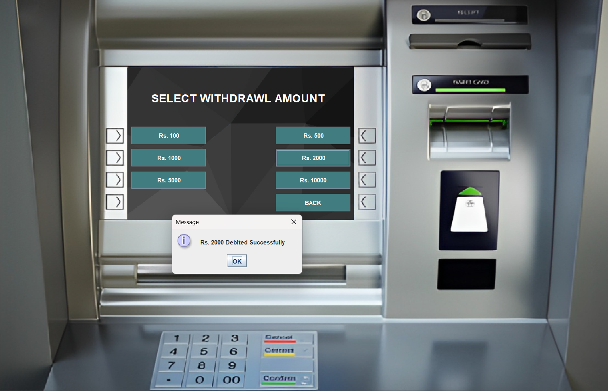
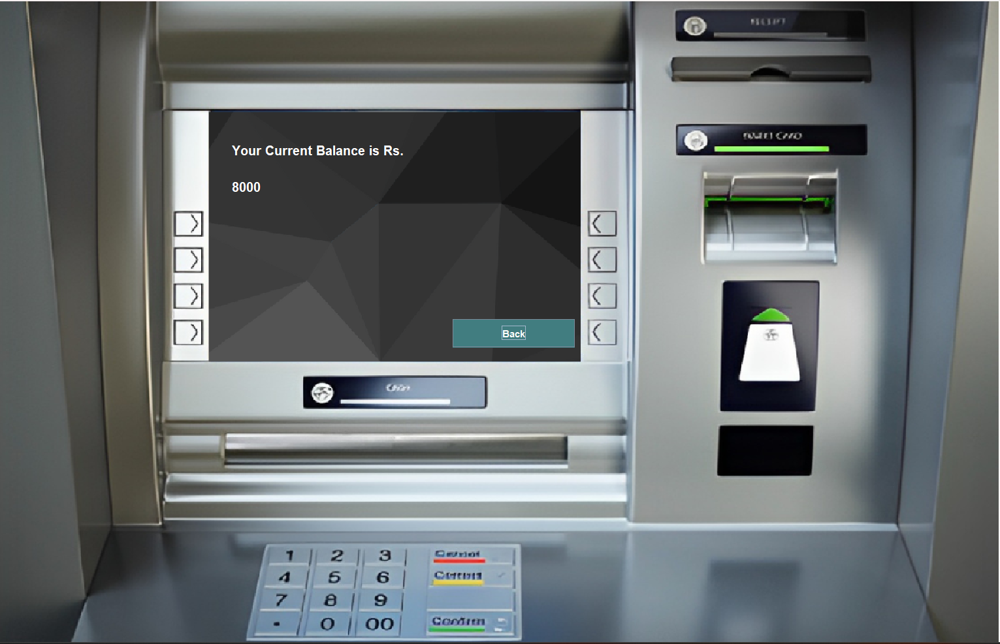
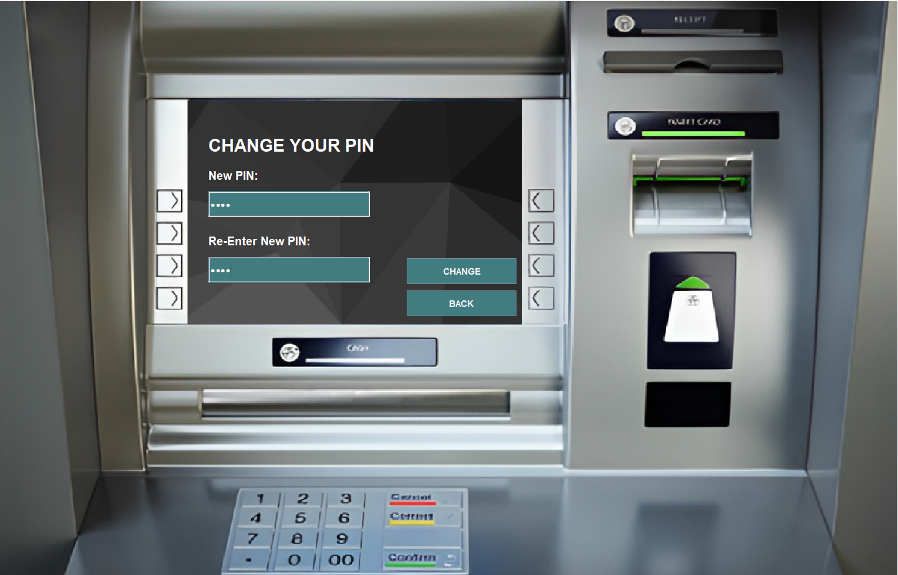
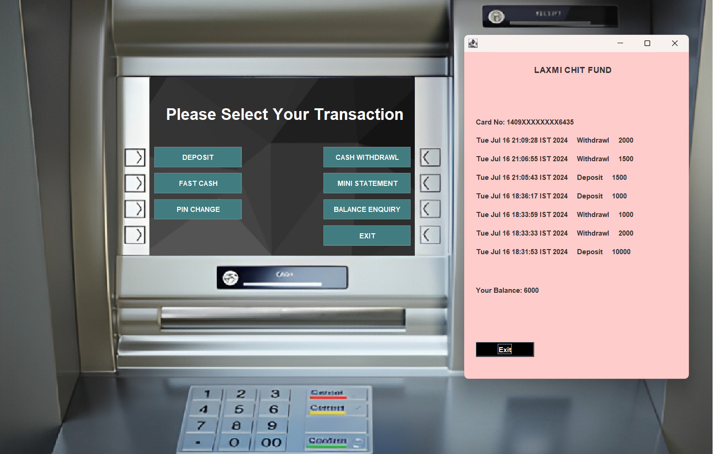

# Bank Management System

## Overview

The Bank Management System is a Java-based application designed to facilitate efficient management of banking operations, including account transactions, balance enquiries, and more. This project provides a robust foundation for handling basic banking functionalities through a user-friendly graphical interface.

## Screenshots
### Login Interface

### Signup Page1

### Signup Page2

### Signup Page3

### Transaction Interface

### Deposit

### Withdrawal

### Fast Cash

### Balance Query 

### Pin Change

### Account Statement

### Features

- **`Login` and `Signup`**: Secure authentication and account creation processes.
- **`Deposit` and `Withdrawal`**: Manage account funds with transaction logging.
- **`Balance Enquiry`**: Check current account balance.
- **`Fast Cash`**: Quick withdrawal options for predefined amounts.
- **`PIN Change`**: Securely update account PIN.
- **`Mini Statement`**: View recent transactions and current balance.

### Technologies Used

- **`Java`**: Core programming language for application logic.
- **`Swing`**: GUI toolkit for designing the user interface.
- **`MySQL`**: Database management system for storing user and transaction data.

## Detailed Functionality

### Login and Signup

The application ensures secure user authentication and registration:
- **Login**: Validates user credentials against stored data in `MySQL`.
- **Signup**: Allows new users to register by entering personal details.

### Deposit and Withdrawal

Users can manage their account balances effectively:
- **Deposit**: Add funds to the account with transaction recording.
- **Withdrawal**: Withdraw funds securely with balance verification.

### Balance Enquiry and Mini Statement

- **Balance Enquiry**: Provides real-time account balance information.
- **Mini Statement**: Displays the latest transactions for account review.

### Fast Cash and PIN Change

- **Fast Cash**: Offers quick withdrawal options for common amounts.
- **PIN Change**: Enables users to update their account PIN for security.

## Setup Instructions

1. **Prerequisites**:
   - Install `Java Development Kit` (JDK) and `MySQL`.
    - Set up `MySQL` database with a schema named `bankSystem`.

2. **Database Configuration**:
    - Import provided SQL scripts (`create_tables.sql`) to create necessary tables (`login`, `signup`, `bank`).

3. **Running the Application**:
     - Import the project into your preferred IDE (IntelliJ IDEA, Eclipse).
    - Compile and run the `Login.java` file to start the application.

## Database Schema

### Tables
 - **login**: Stores user login credentials.
 - **signup**: Holds user basic account details.
 - **signuptwo**: Holds more information about user.
 - **signupthree**: Holds 1st time generated `PIN` and Card no for user.
 - **bank**: Records user transactions (deposit and withdrawal).

## Contributing

We welcome contributions to improve the app. Please fork the repository and submit a pull request with your changes.

               

## License
 This project is licensed under the [MIT License](https://choosealicense.com/licenses/mit/).
